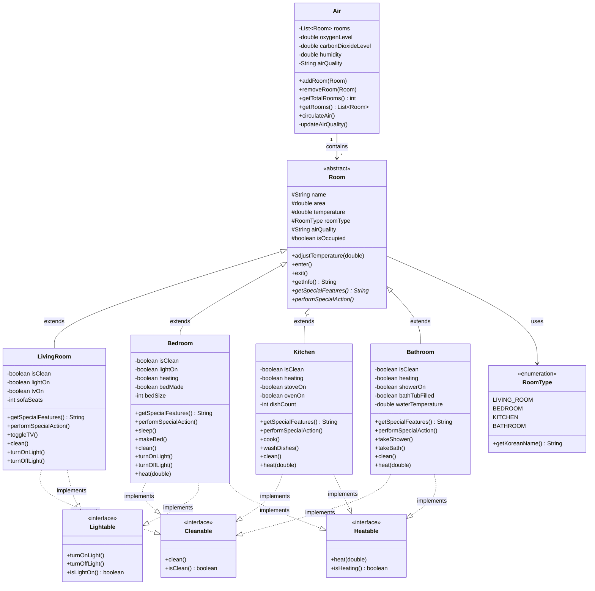

# 클래스 다이어그램 설명

## 🎯 전체 클래스 구조 다이어그램



## 📋 클래스별 상세 설명

### 1. Air 클래스 (최상위 컨테이너)
**역할**: 집 전체의 공기를 관리하는 최상위 객체
**설계 원칙**: 캡슐화 (Encapsulation)

```java
public class Air {
    private List<Room> rooms;           // 방 목록 (캡슐화)
    private double oxygenLevel;         // 산소 농도
    private double carbonDioxideLevel;  // 이산화탄소 농도
    private double humidity;            // 습도
    private String airQuality;          // 공기 품질
}
```

**핵심 기능**:
- 방 추가/제거 관리
- 전체 공기 상태 모니터링
- 공기 순환 시스템

### 2. Room 추상 클래스 (공통 기반)
**역할**: 모든 방의 공통 특성과 동작을 정의
**설계 원칙**: 추상화 (Abstraction)

```java
public abstract class Room {
    protected String name;          // 방 이름
    protected double area;          // 면적
    protected double temperature;   // 온도
    protected RoomType roomType;    // 방 타입
    
    // 추상 메서드 - 각 방에서 구현 필수
    public abstract String getSpecialFeatures();
    public abstract void performSpecialAction();
}
```

**추상화 구현**:
- 공통 속성: 이름, 면적, 온도 등
- 공통 메서드: 온도 조절, 입장/퇴장
- 추상 메서드: 방별 특화 기능

### 3. 구체적인 방 클래스들 (상속 구현)
**설계 원칙**: 상속 (Inheritance)

#### LivingRoom (거실)
```java
public class LivingRoom extends Room 
    implements Cleanable, Lightable {
    private boolean tvOn;       // TV 상태
    private int sofaSeats;      // 소파 좌석 수
}
```

#### Bedroom (침실)
```java
public class Bedroom extends Room 
    implements Cleanable, Lightable, Heatable {
    private boolean bedMade;    // 침대 정리 상태
    private int bedSize;        // 침대 크기
}
```

#### Kitchen (주방)
```java
public class Kitchen extends Room 
    implements Cleanable, Heatable {
    private boolean stoveOn;    // 가스레인지 상태
    private int dishCount;      // 설거지할 그릇 수
}
```

#### Bathroom (욕실)
```java
public class Bathroom extends Room 
    implements Cleanable, Heatable {
    private boolean showerOn;        // 샤워기 상태
    private double waterTemperature; // 물 온도
}
```

### 4. 인터페이스들 (다형성 구현)
**설계 원칙**: 다형성 (Polymorphism)

#### Cleanable 인터페이스
```java
public interface Cleanable {
    void clean();           // 청소 기능
    boolean isClean();      // 청소 상태 확인
}
```

#### Lightable 인터페이스
```java
public interface Lightable {
    void turnOnLight();     // 조명 켜기
    void turnOffLight();    // 조명 끄기
    boolean isLightOn();    // 조명 상태 확인
}
```

#### Heatable 인터페이스
```java
public interface Heatable {
    void heat(double targetTemperature);  // 난방
    boolean isHeating();                  // 난방 상태 확인
}
```

## 🔗 관계 다이어그램

### 상속 관계 (Inheritance)
```
     Room (추상)
       ├── LivingRoom
       ├── Bedroom
       ├── Kitchen
       └── Bathroom
```

### 구현 관계 (Implementation)
```
Cleanable ← LivingRoom, Bedroom, Kitchen, Bathroom
Lightable ← LivingRoom, Bedroom
Heatable  ← Bedroom, Kitchen, Bathroom
```

### 조합 관계 (Composition)
```
Air (1) ◆─── (0..*) Room
```

## 🎨 설계 패턴 적용

### 1. Template Method Pattern
`Room` 추상 클래스에서 공통 로직은 구현하고, 변경되는 부분만 추상 메서드로 정의

### 2. Strategy Pattern
인터페이스를 통해 각 방의 청소, 난방, 조명 기능을 다르게 구현

### 3. Composite Pattern
`Air` 클래스가 여러 `Room` 객체를 관리하는 구조

## ✨ OOP 원칙 구현 요약

| 원칙 | 구현 위치 | 구현 방법 |
|------|-----------|-----------|
| **캡슐화** | Air 클래스 | private 필드, getter/setter 메서드 |
| **상속** | Room ← 각 방 클래스 | extends 키워드, 공통 기능 재사용 |
| **추상화** | Room 추상 클래스 | abstract 메서드, 공통 인터페이스 |
| **다형성** | 인터페이스들 | implements, instanceof 연산자 |

이 설계는 실제 집의 구조를 모델링하면서 객체지향의 핵심 원칙들을 자연스럽게 학습할 수 있도록 구성되었습니다.